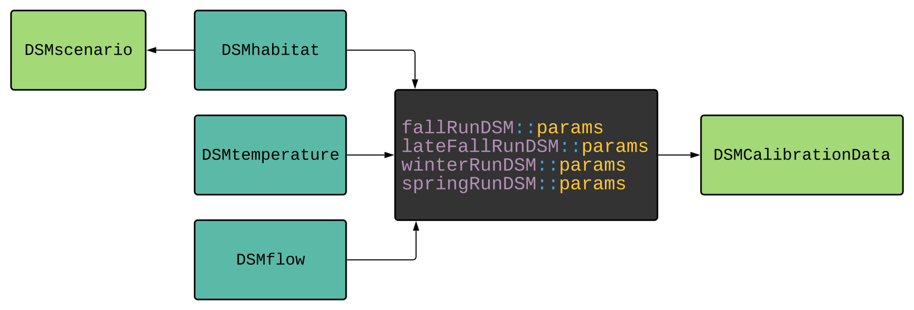

# DSMCalibrationData

Calibration data for CVPIA's Structure Decision Making chinook life cycle models.

This package contains the following calibration datasets:

* `calibration_year_index` and `calibration_year_spawn_index` the set of proxy years used to represent model inputs for 1997-2017 selected from the 1979-2000 simulation inputs.
* `grandtab_imputed` used as seeding values for calibration.
* `grandtab_observed` used for comparison to predicted values in optimization process.

and one function: 

* `set_synth_years` generates model inputs for running the life cycle models in calibration mode. For more information run `?set_synth_years` in the console. 

See the `data-raw/` directory to see the process for creating the datasets listed above.

## Dependencies
The `DSMCalibrationData` package uses data from several other packages within the [CVPIA Open Science Collaborative](https://github.com/CVPIA-OSC). These relationships are visualized in the dependency graph below. 

Data Assembled and Maintained by <a href = "http://www.flowwest.com/" target = "_blank"> 

